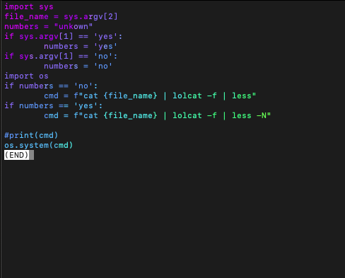
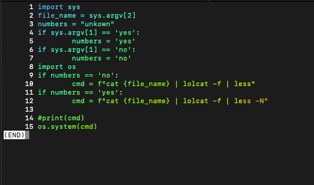
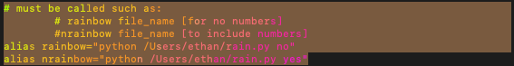
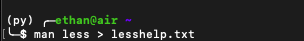
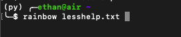
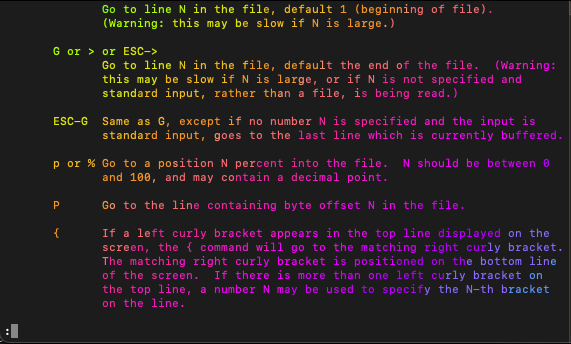

# Rainbow
<hr>
quickly view files with lolcat
<hr>
<h4>Usage:</h4>

```sh
$: rainbow file_name
$: nrainbow file_name
```


<p style="font-size: 12px">rainbow</p>



<p style="font-size: 12px">nrainbow</p>



<hr>
<h5 style="color: red;">Requirements</h5>
<bl style="color: red;">
<li>lolcat</li>
<li>cat</li>
<li>python</li>
<li>less</li>
<li>zsh</li>
</bl>

<h4>Installation:</h4>

1. place rain.py in the same directory as your .zshrc file

2. add the following aliases to your .zshrc:




```sh
# must be called such as:
	# rainbow file_name  [for no numbers]
	#nrainbow file_name  [to include numbers]

alias rainbow="python /YoUrUsErDiReCtOrY/YoUrUsErNaMe/rain.py no"
alias nrainbow="python /YoUrUsErDiReCtOrY/YoUrUsErNaMe/rain.py yes"
```

restart your shell:
```sh
source .zshrc
```
<br>
<h2>Demo</h2>
write the less man page to a text file



read the less help page using <b>rainbow</b>


successful installation of rainbow:



hit q to quit its just piping into lolcat and then into less using alias for quick calls