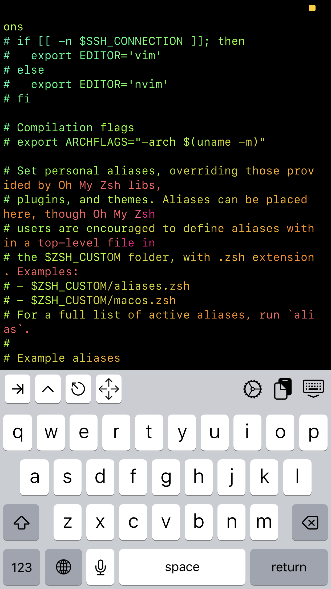

# Rainbow | wobniaRn
<hr>
quickly view files with lolcat
<hr>
<h4>Usage:</h4>

<div style="font-size: 14px">
rainbow file_name

nrainbow file_name
</div>


## Rainbow Demo
```sh
$: rainbow Rainbow/rain.py
```


## nRainbow Demo
```sh
$: nrainbow Rainbow/rain.py
```


<div style="background-color: black; padding-left: 20px; padding-bottom: 20px; width: 15em; border-style: solid; border-width: 5px; border-color: red">
<h5 style="color: red;">Requirements</h5>
<hr style="color: red; color: red; background-color: red: height: 5px">
<bl>
<li>lolcat</li>
<li>cat</li>
<li>python</li>
<li>less</li>
<li>zsh</li>
</bl>
</div>


<hr>

<h1>Installation:</h1>

1. place rain.py in the same directory as your .zshrc file

2. add the following aliases to your .zshrc:


```sh
# must be called such as:
	# rainbow file_name  [for no numbers]
	#nrainbow file_name  [to include numbers]

alias rainbow="python where-tf-is-rain/rain.py no"
alias nrainbow="python where-tf-is-rain/rain.py yes"
```

restart your shell:
```sh
source .zshrc
```
<hr>
<h2>Demo</h2>
write the less man page to a text file


read the less help page using <b>rainbow</b>


successful installation of rainbow:


<hr>

hit q to quit (you in less still)

<br>
<hr>
# Does not work in ish

Alternative found:
Remove less from cmd and just use cat to lolcat or lolcat 




<hr> 

# Termux Fix:  

remove everything after lolcat in between quotes for both lines, 

add this alias along with the previous ones to bashrc:  

alias rainbow="sh /data/data/com.termux/files/home/GitHub/Rainbow/rain_mobile.sh"  

now when you call rainbow $yourfilename$ a new tmux window will open and display your file only preventing overscrolling through history 

ctrl+d to exit rainbow 

:)


 
 
^ current aliases using rainbow on termux android

